# 10. 主要フローのシーケンス図

各フローの処理の流れを Mermaid で示す。実装時の参照用。

## アプリ起動

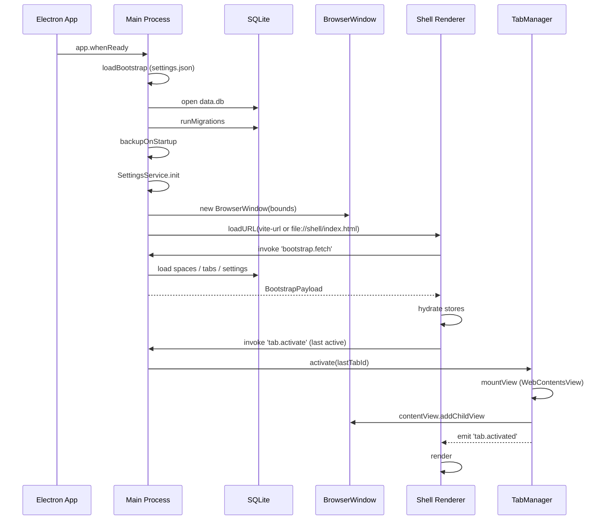

## 新規タブ生成（コマンドバーから）

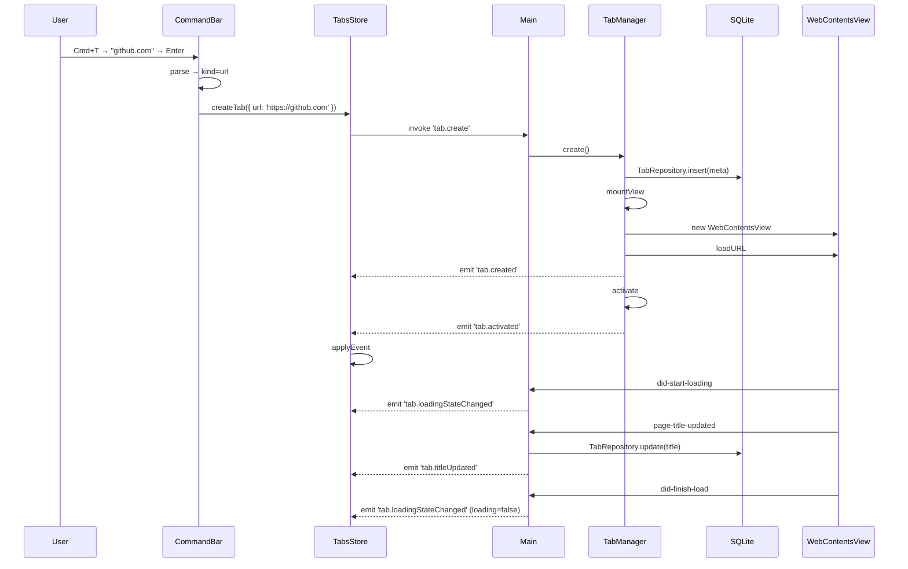

## URL 遷移（既存タブで）

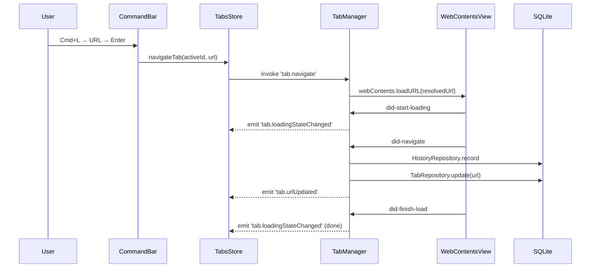

## タブを閉じる（archived 行き）

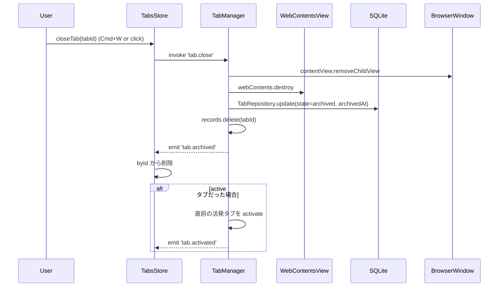

## タブの discard（自動スリープ）

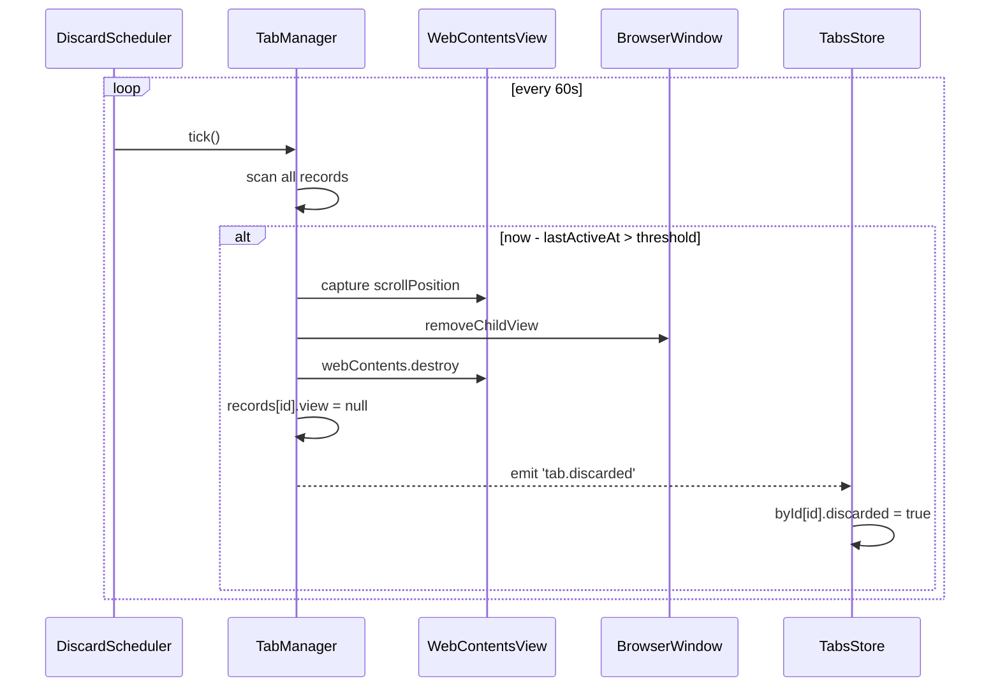

## discarded タブの再アクティブ化

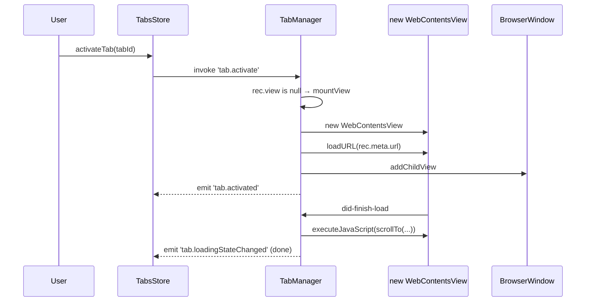

## クラッシュからの復旧

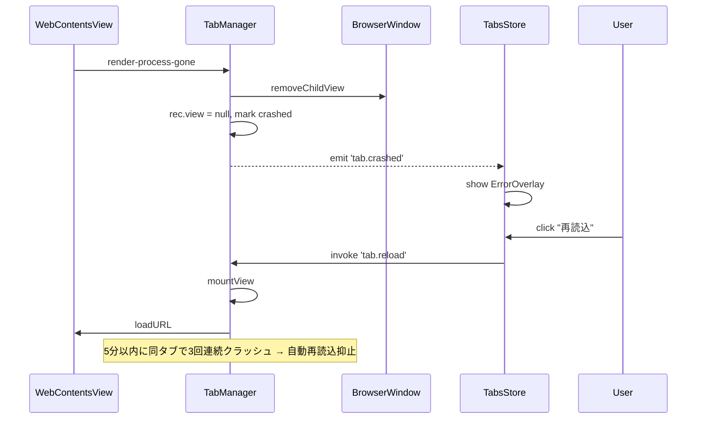

## サイドバーリサイズ → WebView の追従

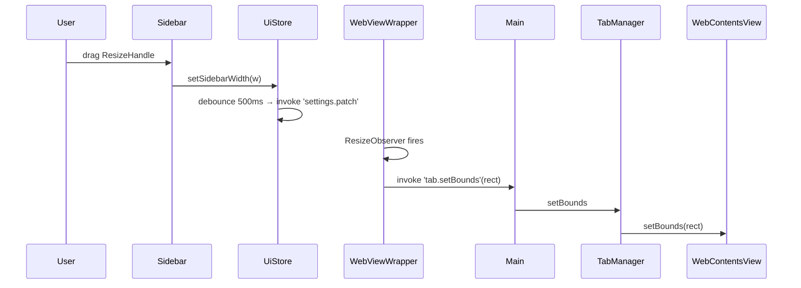

## 設定変更の反映

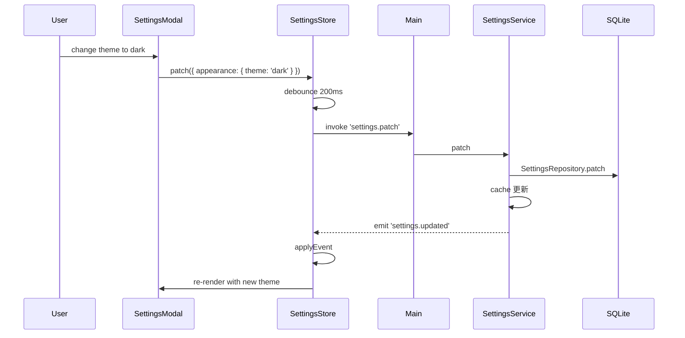

## コマンドバーの候補生成

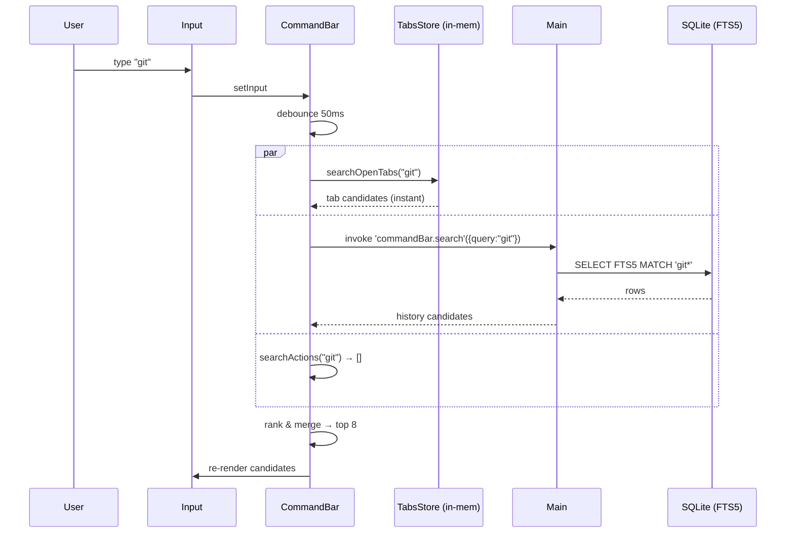

## アプリ終了

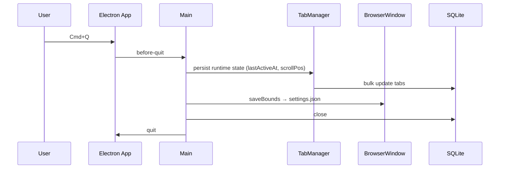

## エラーフロー（ネット切断）

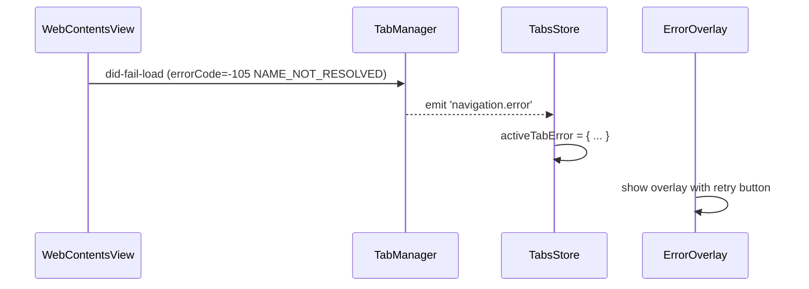

## 自動アーカイブ（today → archived）

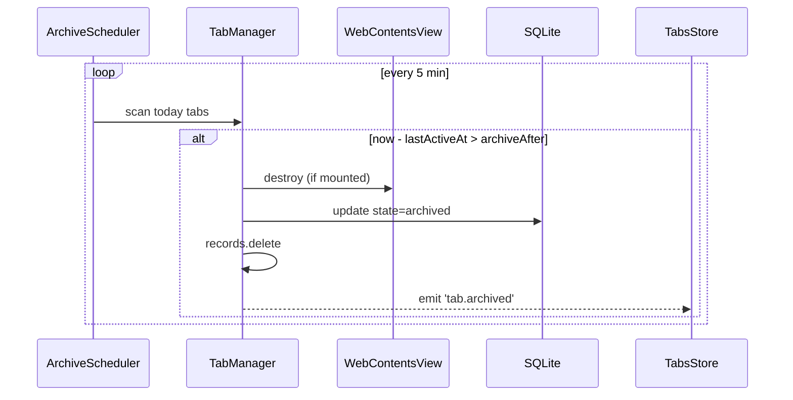

## 不変条件のまとめ
これらのフローを通じて以下が常に成り立つ：
- DB の `tabs.state` と `records` の存在は一貫（archived は records になし）
- 各 active タブは必ず view を持つ
- broadcaster は同じイベントを 2 回発行しない
- shell store は IPC イベント以外でタブを生成・削除しない（直接書き換え禁止）
